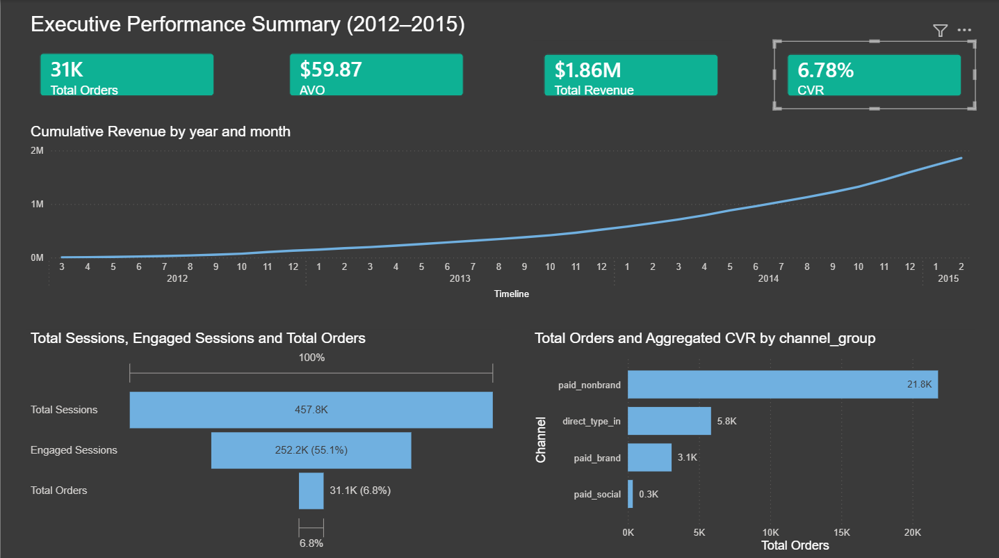
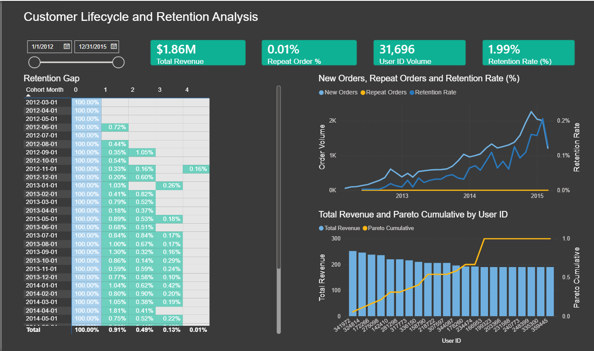

# Project: E-Commerce Data Warehouse and Business Intelligence Pipeline

## 1. Project Overview and Objective
This project establishes a comprehensive Extract, Transform, Load (ETL) and Online Analytical Processing (OLAP) pipeline to transform raw transactional data into an optimized dimensional model.

The primary objective is to create a robust data foundation within a SQLite data warehouse that supports deep analytical querying and serves as the single source of truth for Business Intelligence (BI) reporting in Power BI.

Key Deliverables:
ETL Pipeline Design: Scripts for data cleaning, splitting, and robust loading.

Dimensional Model: Creation of Fact Tables (fact_sales) and Dimension Tables (e.g., dim_date, dim_customer) optimized for reporting performance (star schema).

BI Readiness: Creation of analytical SQL Views or Materialized Tables for direct consumption by Power BI dashboards.

---
## 2. Data Source and Compatibility Note
The raw dataset for this project originates from the LinkedIn Learning: Advanced MySQL Data Analysis course. The original SQL file was structured for MySQL environments, which posed significant compatibility challenges for bulk loading into SQLite.

The ETL sequence below specifically addresses these challenges, particularly the use of multi-line INSERT INTO ... VALUES statements and incompatible control commands (SET AUTOCOMMIT=0;), ensuring the data is parsed and loaded reliably into the SQLite environment.

### Database Structure (Star Schema)

The transformation process populates the following key tables in the `maven_factory.db` database:

| Type | Table Name | Purpose | Key Metrics |
| :--- | :--- | :--- | :--- |
| **Raw Source** | `website_sessions`, `orders`, etc. | Raw data loaded directly from source files (Phase 1). | None (Raw Data) |
| **Dimension** | `dim_session_activity` | One row per session, enriched with bounce flag and **channel group**. | Traffic, Bounce Rate, Device Type |
| **Fact** | `fact_orders` | Stores one row per order. | Revenue, AOV, Cogs |
| **View (Reporting)**| `v_daily_analytics_summary` | **The final output.** Aggregates all metrics daily by `channel_group`. | All primary KPIs |

---
## 3. Analytical Pipeline (Transform Phase)
Upon successful data ingestion, the ETL pipeline shifts focus to building a dimensional model optimized for key business analysis and reporting.

**Dimensional Modeling (The Data Warehouse)**
The pipeline transforms the raw operational data into a Star Schema by creating three central fact and dimension tables. This structure is designed to isolate metrics and attributes for high-speed BI reporting.

- dim_session_activity **(Dimension Table)**:

  - Purpose: The central dimension table for Web Metrics (e.g., Bounce Rate, Pageviews, Traffic Source).
  - Content: Contains one row per website session, pre-calculated with the is_bounced flag and all key segmentation attributes (device_type, traffic_source, landing_page).

- fact_orders **(Fact Table)**:

  - Purpose: The central table for Order-Level Financial Metrics (e.g., Conversion Rate, Average Order Value, Total Revenue, Total Margin).
  - Content: Contains one row per completed order with aggregated financials (price_usd, cogs_usd) and links to the user and session.

- fact_order_items **(Fact Table - New)**:

  - Purpose: Enables detailed Product and Cross-Sell Analysis.
  - Content: Contains one row for every individual item purchased in an order, allowing for analysis of product bundles, refunds, and item-level profitability.

- dim_date **(Dimension Table)**:

  - Purpose: Enables time-series analysis (Daily, Weekly, Monthly) for all metrics.
  **Analytical Views** 
  - Goal: SQL Views will be created on top of the dimensional model to pre-aggregate high-level metrics (e.g., monthly sales summary, top traffic sources) into simplified, flat tables.
  - Benefit: This provides the BI tool with fast, ready-to-consume data sources, eliminating the need for complex DAX or M code and speeding up report load times.

---
## 4. Data Ingestion Sequence (The ELT 'Extract' and 'Load' Phases)
This sequence outlines the steps required to prepare the raw data and successfully load the transactional tables into the maven_factory.db database.

### Phase 1: Raw Data Ingestion (Prerequisites)

This phase prepares the raw SQL data and loads it into the database's source tables (located in the `ingestion` folder).

| Step # | File Used / Action | Location | Purpose |
| :---: | :--- | :--- | :--- |
| **1.0** | `clean_sql_data.py` | `ingestion/` | **Splits and Cleans Raw Data.** Reads the source data, splits it into table-specific files (e.g., `orders_insert_data.sql`), and ensures SQLite compatibility. |
| **2.0** | **Terminal Command** | Project Root | **Schema Load.** Executes `mavenfactory_schema.sql` to **create all empty raw tables** in `maven_factory.db`. |
| **3.0** | `db_loader.py` | `ingestion/` | **Robust Data Loading.** Reads the cleaned SQL files from the output folder and loads all raw data into the corresponding tables. |
| **4.0** | `verify_data.py` | `ingestion/` | **Quality Check.** Confirms non-zero record counts in all raw tables. |

### Phase 2: Data Modeling and Reporting Layer Creation (ELT Phase)

This phase transforms the raw data into the final BI-ready reporting view (scripts located in `src/data_pipeline/`).

| # | Script Name | Function | Output |
| :-: | :--- | :--- | :--- |
| **5.0** | `elt_core_load.py` | **Load Core Data:** Clears and reloads data into the final `dim_session_activity` and `fact_orders` tables. | Populated `dim_session_activity` and `fact_orders`. |
| **6.0** | `update_dimensions.py`| **Data Enrichment:** Adds and populates the crucial `channel_group` column using defined business logic. | Enriched `dim_session_activity`. |
| **7.0** | `create_analytical_views.py` | **Reporting Layer:** Creates the final aggregated analytical view, `v_daily_analytics_summary`. | Final view ready for Power BI. |

###  Execution Command

Run the following scripts sequentially from the project root (`maven-store-analysis/`):

```bash
python src/data_pipeline/elt_core_load.py
python src/data_pipeline/update_dimensions.py
python src/data_pipeline/create_analytical_views.py
 ```
---
## 5. Reporting and Visualization
This phase covers connecting the final analytical view (v_daily_analytics_summary) to Power BI Desktop for visualization.

### Connecting Power BI to the SQLite Database (ODBC Method)
Since the maven_factory.db is a local file, the most reliable connection method is through an established System Data Source Name (DSN) using an ODBC Driver. This saves the connection path and driver details, eliminating the need to re-enter the connection string for every refresh.

### Dashboard Design

The final Power BI dashboard follows an executive layout, designed to move from high-level metrics to granular operational drivers.

**Primary Visuals & Logic:**

Traffic Segmentation:

- paid_brand: Traffic from users specifically searching for your company name (e.g., "Maven Store"). This usually has the highest CVR because the user already knows and wants the brand.

- paid_nonbrand: This represents paid search traffic where the user did not search for a specific brand name. strategy is successfully capturing "generic" search intent rather than relying solely on existing brand loyalty.

- direct_type_in: Users who typed the URL directly into their browser or used a bookmark. This represents high brand loyalty and returning customers.

- paid_social: Traffic coming from paid advertisements on platforms like Facebook or Instagram. As seen in your funnel, this often has a lower CVR compared to search, as it is "disruption" marketing rather than "intent-based" search.

January 2014: Multi-Channel Expansion

The business launched Paid Social campaigns (e.g., Facebook/Instagram ads) to diversify traffic sources.
This launch coincided with the sharp upward trend in Cumulative Revenue, which scaled from under $0.5M to $1.86M following this expansion.
Launching Paid Social marked a pivotal shift in our marketing strategy, directly contributing to the surge in traffic and the rapid scaling of revenue seen throughout 2014.

 

- **KPI:** Displays Total Orders (31K), Average Order Value ($59.87), Total Revenue ($1.86M), and Conversion Rate (6.78%) to provide an instant health check of the business.
- **Growth Trend:** A cumulative revenue line chart that highlights the significant "Hockey Stick" growth pivot occurring in early 2014.
- **Conversion Funnel:** Visualizes the efficiency of the user journey, showing the drop-off from 457.8K Sessions down to 31.1K Orders.
- **Channel Performance:** A bar chart identifying paid_nonbrand as the primary driver for order volume, allowing executives to see exactly which marketing investments are yielding the highest returns.

## 6. Key Business Insights
The BI layer revealed several critical findings that would have been difficult to track in raw transactional tables:

1. High-Efficiency Conversion: The site maintains a robust 6.78% CVR. This indicates strong product-market fit and a frictionless checkout process.

2. Scalable Revenue Model: While 2012 and 2013 were foundational years, the infrastructure supported a massive revenue surge in 2014, proving the scalability of the current marketing mix.

3. Healthy Average Basket: An AVO of $59.87 suggests that customers are not just buying single low-cost items, but are engaging with the product catalog at a significant price point.

### Executive Dashboard Analysis (Dashboard 1)
The finalized dashboard provides the business performance from 2012 to 2015:

- **Financial** Growth: A $1.86M Total Revenue reflects a successful scaling phase that began in early 2014.

- **Operational Efficiency:** The 6.78% Aggregated CVR and 6.8% conversion at the bottom of the funnel demonstrate high traffic quality.

- **Customer Behavior:** An AVO of $59.87 indicates a strong value proposition per transaction.

- **Marketing Impact:** paid_nonbrand is the dominant driver of volume, accounting for the vast majority of the 31K Total Orders.

### Business Recommendations

1. Scale "Top-of-Funnel" Generic Search
Observation: paid_nonbrand is the largest volume driver, contributing over 21K orders.
Recommendation: Increase budget allocation for non-branded search terms. 

2. Optimize the "Social" Conversion Gap
Observation: paid_social has the lowest order volume despite being a key part of the 2014 growth expansion.
Recommendation: Conduct A/B testing on social media landing pages. Improving this would maximize the return on the investment started in Jan 2014.

3. Maximize High-Intent "Direct" Traffic
Observation: direct_type_in is the second-largest channel, indicating strong brand recall.
Recommendation: Implement a loyalty or referring program. This rewards the users who already come to the site directly and helps increase revenue without additional ad spend.

### Performance and Loyalty Analysis (Dashboard 2)

 

This analysis evaluates the the customer lifecycle and retention for Maven Factory. While acquisition is scaling successfully, the data reveals a significant retention issue. The primary goal of this dashboard is to move beyond initial sales and understand the behavior of the repeat customer segment.

- **User Volume (KPI Card):** A large basis of 31,696 users, showing strong market reach.

- **Retention Crisis:** Despite the large user base, retention drops off almost entirely after Month 0, with Month 1 retention averaging only 0.91%.

- **Revenue Concentration (Pareto):** The Pareto chart shows that a tiny fraction of the repeaters is responsible for the vast majority of the revenue, while the rest are likely one-time "New" buyers.

- **Order Trend (New vs. Repeat):** The large blue area (New Orders) compared to the thin orange line (Repeat Orders) confirms that despite having 31,000+ users, the business has not yet built a reliable loyalty base.

### Strategic Recommendations

1. Implement a Post-Purchase "Hook": With Month 1 retention below 1%, the business should implement email marketing or discount incentives immediately after the first purchase to drive that second order.

2. Optimize Custom Landers for Repeaters: Currently, high-converting landers like /lander-5 (10.17% conv. rate) are only seeing "New" traffic. Testing these pages for returning "Brand" traffic could yield even higher conversion rates than the current 7.83%.

3. Premier Loyalty Program: Use the Pareto Analysis to identify the specific user_ids in the top 20% of revenue and enroll them in an exclusive loyalty tier to protect the core revenue stream.

## 7. Future Projects

- A/B Testing for landing and billing pages 
- Bounce rate analysis 
- Channel performance analysis 

